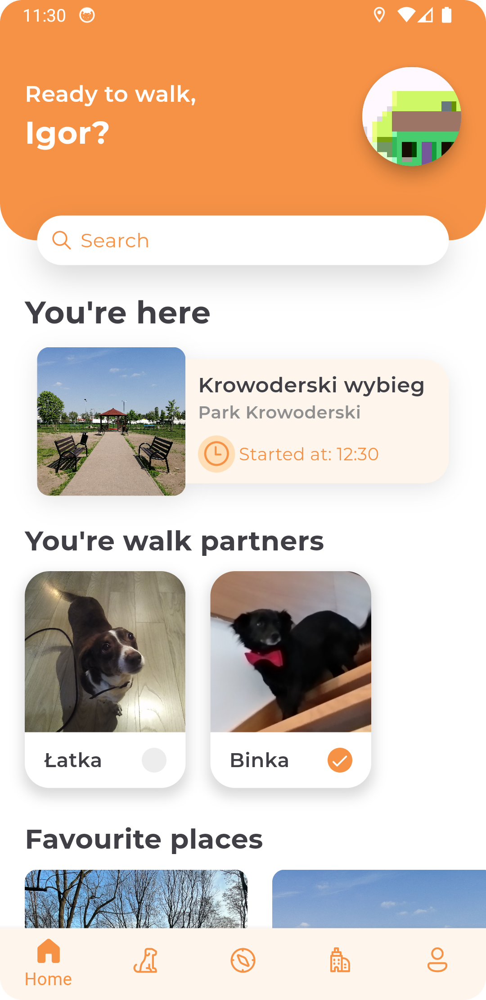
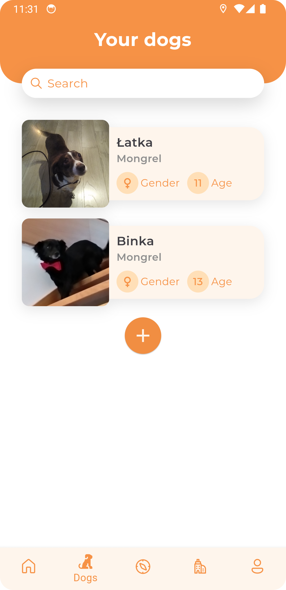
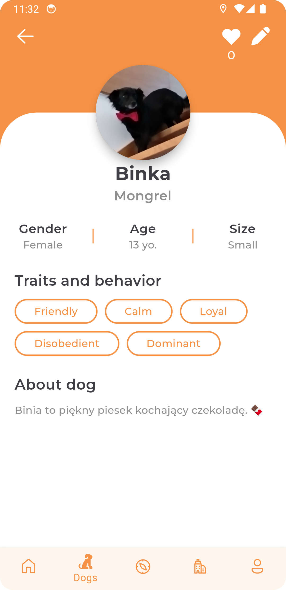
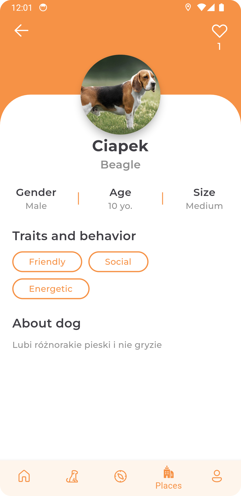
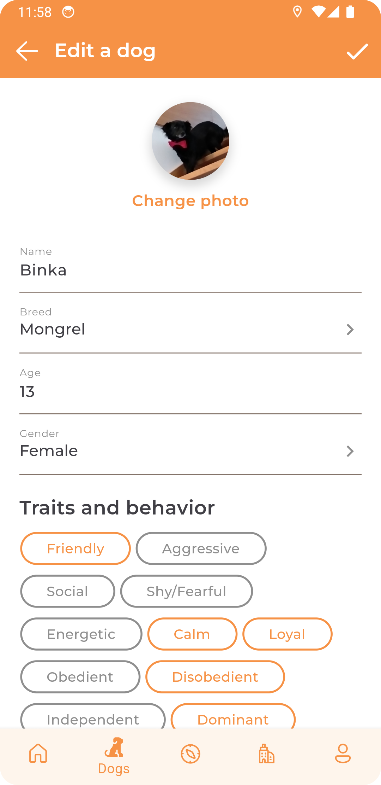
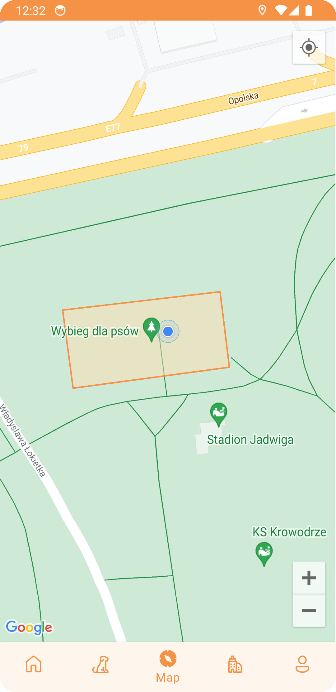
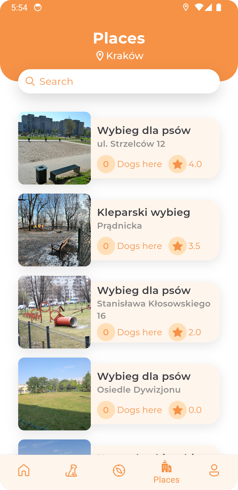
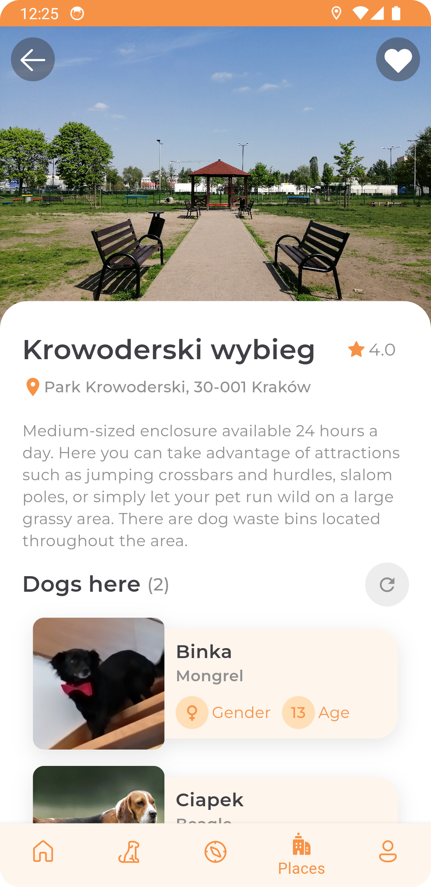

# PawGuider

> An application facilitating walking with a dog in the city.

## Table of contents

* [General Information](#general-information)
* [Technologies Used](#technologies-used)
* [Features](#features)
* [Screenshots](#screenshots)
* [Project Status](#project-status)

## General Information

PawGuider comprises of two main components:
- A mobile app created using Flutter.
- The server-side, developed with Spring Boot.

> **_NOTE:_** This application was developed as a part of my engineering thesis. I have decided to share it here as part of my portfolio.

## Technologies Used

- Java
- Spring Boot
- Dart
- Flutter
- PostgreSQL
- Google Maps Platform
- Figma

## Features

- Creating, editing and removing detailed dog profiles.
- Browsing through a collection of user-uploaded dog profiles.
- Browsing available dog runs and parks profiles.
- Marking dogs to be visible on specific dog runs profiles.
- Tracking user localisation and automatically marking their presence when within a designated dog run area.
- Google Maps integration for displaying marked parks areas for a quick and convenient overview.
- Viewing information about dogs that are within any dog run area.
- Marking places as favourites.

## Screenshots

    
    
    
    
    
    
    
    

 

> **_NOTE:_** These screenshots were used in my engineering thesis.

## Project Status

The project is **complete** with a room for improvements.
